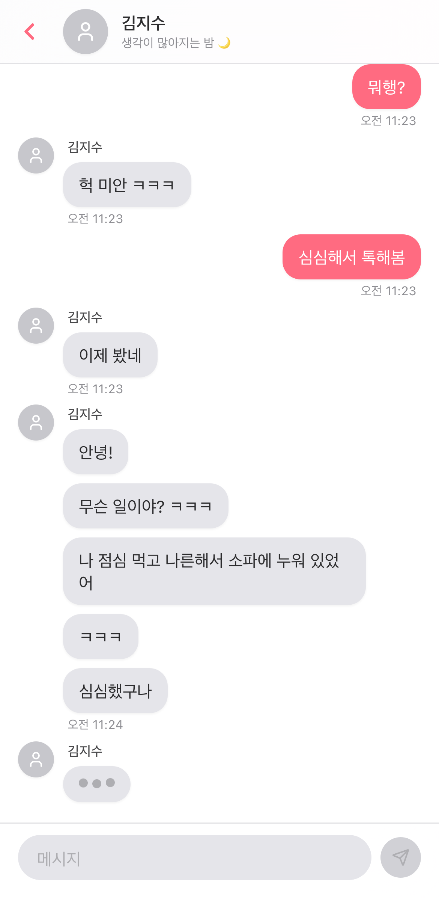

# ○○와 채팅하기

<p align="center">
  
</p>

Full-stack web application that creates realistic Korean messaging conversations with dynamically generated AI personas.

## Screenshots

<p align="center">
  
  
</p>

## Features

- **Realistic AI Conversations**: Korean messaging patterns with fragmentation, slang, and authentic behavior
- **Multi-User Support**: Single AI persona shared across all users with independent conversations
- **Seasonal Rotation**: AI persona changes every 3 months with warnings
- **Real-Time**: WebSocket-based live messaging with typing indicators and read receipts
- **PWA**: Progressive Web App with push notifications
- **iOS-Inspired UI**: Clean, modern interface resembling iOS messaging apps

## Tech Stack

### Backend
- Ruby on Rails 8.0.4 (API mode)
- PostgreSQL with JSONB
- ActionCable (WebSocket)
- Sidekiq (background jobs)
- Google Gemini AI

### Frontend
- Next.js 15 + React 19
- TypeScript
- Tailwind CSS
- ActionCable client
- Service Worker + Push API

## Quick Start

### Prerequisites

- Ruby 3.4+
- Node.js 20+
- PostgreSQL 14+
- Redis 7+
- Google Gemini API key

### Backend Setup

```bash
cd backend

# Install dependencies
bundle install

# Setup database
rails db:create
rails db:migrate
rails db:seed

# Set environment variables
cp .env.example .env
# Edit .env and add your GEMINI_API_KEY

# Start Redis (in separate shell)
redis-server

# Start Sidekiq (in separate shell)
bundle exec sidekiq

# Start Rails server
rails server -p 3001
```

### Frontend Setup

```bash
cd frontend

# Install dependencies
npm install

# Set environment variables
cp .env.local.example .env.local
# Edit .env.local:
# NEXT_PUBLIC_API_URL=http://localhost:3001
# NEXT_PUBLIC_WS_URL=ws://localhost:3001/cable
# NEXT_PUBLIC_VAPID_PUBLIC_KEY=(generate with webpush gem)

# Start Next.js dev server
npm run dev
```

### Generate VAPID Keys (for push notifications)

```bash
# In backend directory
rails console

# Run this:
require 'webpush'
vapid_key = Webpush.generate_key

# Add to backend/.env:
# VAPID_PRIVATE_KEY=<vapid_key.private_key>
# VAPID_PUBLIC_KEY=<vapid_key.public_key>

# Add to frontend/.env.local:
# NEXT_PUBLIC_VAPID_PUBLIC_KEY=<vapid_key.public_key>
```

## Usage

1. Open http://localhost:3000 in your browser
2. The app will auto-authenticate using a device ID
3. Start chatting with the AI persona
4. Allow notifications for push updates (optional)

## Architecture

### Key Components

**Backend:**
- AI Services: Persona generation, message generation, action decisions
- Persona Tools: Calendar, Reminder, Memo, Diary, Todo, Contacts, WebSearch, WebFetch
- Background Jobs: AI decision making, state evolution, season rotation
- API Controllers: RESTful endpoints for all resources
- ActionCable: Real-time messaging and app state updates

**Frontend:**
- React Hooks: Auth, conversation, app state, push notifications
- Components: Chat UI, profiles, notifications
- Services: API client, WebSocket client, utilities

## Development

### Running Tests

```bash
# Backend
cd backend
bundle exec rspec

# Frontend
cd frontend
npm test
```

### Database Migrations

```bash
cd backend
rails generate migration MigrationName
rails db:migrate
```

### Adding New Features

1. Backend: Create service, job, controller, and routes
2. Frontend: Create hook, component, and integrate
3. Update types in `frontend/types/index.ts`

## Production Deployment

### Backend

1. Set production environment variables
2. Run `rails assets:precompile` if needed
3. Run `rails db:migrate`
4. Deploy to hosting platform (Heroku, Render, etc.)
5. Start Sidekiq worker processes

### Frontend

1. Set production environment variables
2. Run `npm run build`
3. Deploy to Vercel, Netlify, or similar
4. Configure CORS on backend for production domain

## Environment Variables

### Backend (backend/.env)

```
GEMINI_API_KEY=your_gemini_api_key
GEMINI_MODEL=gemini-2.5-flash
REDIS_URL=redis://localhost:6379/1
DATABASE_URL=postgresql://localhost/chat_with_ai_development
VAPID_PRIVATE_KEY=your_vapid_private_key
VAPID_PUBLIC_KEY=your_vapid_public_key
APP_VERSION=1.0.0
```

### Frontend (.env.local)

```
NEXT_PUBLIC_API_URL=http://localhost:3001
NEXT_PUBLIC_WS_URL=ws://localhost:3001/cable
NEXT_PUBLIC_VAPID_PUBLIC_KEY=your_vapid_public_key
```

## License

This project is licensed under the MIT License - see the [LICENSE](LICENSE) file for details.

## Contributing

Pull requests are welcome. For major changes, please open an issue first to discuss what you would like to change.
